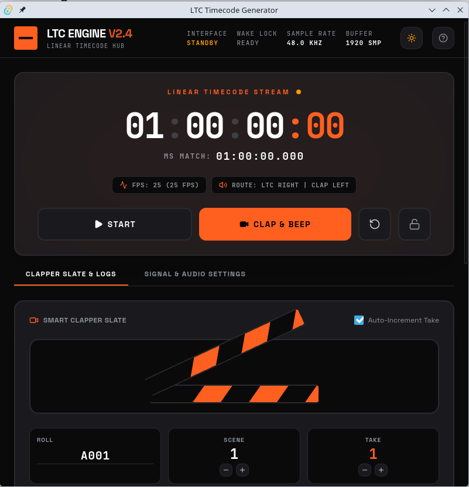

A LTC timecode generator webapp that shows the currently running LTC time, and
has a digital clapper funtion. Primarily vibecoded to be good enough for
practical application.

* Packaging & Deploying

Packaging your React/Vite application into a native desktop app using Tauri is
a highly efficient choice. Tauri utilizes the system's native webview (WebKit
on Linux/macOS, WebView2 on Windows) combined with a robust Rust backend. This
keeps the final binary size extremely small (around 5–10 MB) and uses very
little memory compared to Electron.  Here is a step-by-step guide tailored to
your specific React project to turn it into a standalone desktop application.

** Install Rust & System Prerequisites

Before you begin, your local development machine needs the Rust compiler and system webview packages installed.

*Linux (Debian/Ubuntu)*:

#+begin_src bash
  sudo apt update
  sudo apt install -y libwebkit2gtk-4.1-dev build-essential curl wget file libssl-dev libgtk-3-dev
  # For 32 bit deployment
  sudo apt install libwebkit2gtk-4.1-dev:armhf # ARMv7
  sudo apt install libwebkit2gtk-4.1-dev:i386 # i686
#+end_src

*macOS*:

Install Xcode Command Line Tools:
#+begin_src bash
  xcode-select --install
#+end_src

*Windows*:

Download and run the Rustup installer and install the C++ build tools via Visual Studio Build Tools.

Once prerequisites are met, install Rust:

#+begin_src bash
  curl --proto '=https' --tlsv1.2 -sSf https://sh.rustup.rs | sh
#+end_src

** Install v2 tauri cli

#+begin_src bash
  cargo install tauri-cli --version "^2.0.0" --locked
#+end_src

** Test and Run Locally in Desktop Mode

You can now run your application in a local native desktop window. Tauri will
start Vite in the background, spin up the Rust core, and display your React
interface inside the native webview:

#+begin_src bash
  npx tauri dev
#+end_src

** Build the Production Executable

When you are ready to package your application into a production-ready, standalone binary, run:

#+begin_src bash
  npm run build
  cd src-tauri
  cargo tauri build
  # npx tauri build
#+end_src

This command will:
- Run npm run build to compile your TypeScript/React code into optimized HTML,
  JS, and CSS inside /dist.
- Compile the Rust backend from source.
- Package everything into a standalone executable (e.g., .deb / .AppImage on
  Linux, .app / .dmg on macOS, .msi on Windows) inside
  src-tauri/target/release/bundle/.

To build 32bit versions, make sure you have docker installed on you system, then:
#+begin_src bash
  ./build-32bit.sh
#+end_src

* Installing Docker

** Ubuntu

#+begin_src bash
  sudo curl -fsSL https://download.docker.com/linux/ubuntu/gpg -o /etc/apt/keyrings/docker.asc
  sudo chmod a+r /etc/apt/keyrings/docker.asc
  echo "deb [arch=$(dpkg --print-architecture) signed-by=/etc/apt/keyrings/docker.asc] https://download.docker.com/linux/ubuntu $(. /etc/os-release && echo "$VERSION_CODENAME") stable" | sudo tee /etc/apt/sources.list.d/docker.list > /dev/null
  sudo apt update
  sudo apt install docker-ce docker-ce-cli containerd.io docker-buildx-plugin docker-compose-plugin  
#+end_src

Allow non root (i.e. you) users to run docker:
#+begin_src bash
  sudo usermod -aG docker $USER
  newgrp docker
#+end_src
