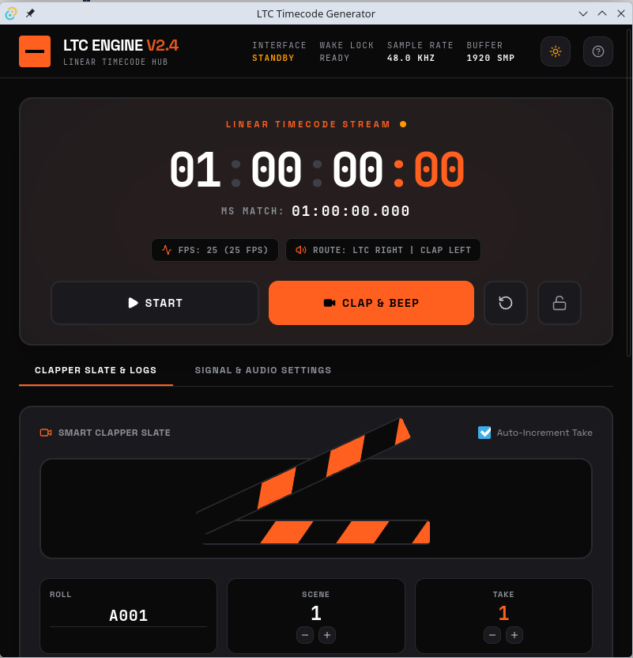

A SMPTE LTC timecode generator + digital clapper for multi-camera video sync,
with native desktop GUIs (ltc-gui / ltc-slint), LTC decoding, recording
conversion, and camera-card offloading. Primarily vibecoded to be good enough
for practical application.

The ltc-gui interface:

* System Dependencies

You need to have rust installed.

For the audio backend, you will need the pipewire & pulseaudio dev libraries:
- Debian/Ubuntu :: =sudo apt install libpipewire-0.3-dev libpulse-dev=
- Fedora/RHEL :: =sudo dnf install pipewire-devel pulseaudio-libs-devel=
- Arch Linux :: =sudo pacman -S pipewire libpulse=

* Compiling the Rust GUI

Setup:

#+begin_src bash
  cargo install cargo-zigbuild
#+end_src

Compilation:

#+begin_src bash
  cargo zigbuild --release --bin ltc-gui
  cargo zigbuild --release --bin ltc-slint
#+end_src

** Compiling the 32bit version

#+begin_src bash
  docker build --platform linux/386 -t ltc-debian11-builder -f Dockerfile.gui-build .
  docker run --rm \
         -v "$(pwd)":/app \
         -v "$(pwd)/.cargo_cache:/usr/local/cargo/registry" \
         -w /app/ltc-gui \
         ltc-debian11-builder \
         cargo zigbuild --target i686-unknown-linux-gnu.2.31 --release
#+end_src

** Cross compiling from linux to windows

Install the windows target:
#+begin_src bash
  rustup target add x86_64-pc-windows-gnu
#+end_src

Install the cross-compilation linker:
#+begin_src bash
  sudo apt update
  sudo apt install mingw-w64
#+end_src

Place the following toolchain config in =.cargo/config.toml= in the project
root (this is a developer-local setting, so not committed to git):
#+begin_src toml
  [target.x86_64-pc-windows-gnu]
  linker = "x86_64-w64-mingw32-gcc"
#+end_src

Now compile with:
#+begin_src bash
  # dev
  cargo build --target x86_64-pc-windows-gnu
  # release
  cargo build --target x86_64-pc-windows-gnu --release --bin ltc-gui
  cargo build --target x86_64-pc-windows-gnu --release --bin ltc-slint
#+end_src

* Running the Rust GUI

#+begin_src bash
  cd ltc-gui
  cargo run                    # Debug
  cargo run --release          # Release (12MB stripped)
  LIBGL_ALWAYS_SOFTWARE=1 cargo run  # Force software rendering for GPU-less testing
#+end_src
or in the project root:
#+begin_src bash
  cargo run --bin ltc-gui
  cargo run --bin ltc-slint
#+end_src

To run the rust GUI with debug output, use:
#+begin_src bash
  RUST_LOG=info cargo run --release
  # with granular settings:
  RUST_LOG=audio_core=info,ltc_gui=info cargo run --release
#+end_src

* Releases

Official releases are tag-driven: pushing a =vX.Y.Z= tag (strict
=v<major>.<minor>.<patch>=, cut via =scripts/bump-version.sh=) runs
=.github/workflows/release.yml=, which builds the ship matrix and publishes
a GitHub Release whose body is the matching =VERSION_LOG.org= entry.

Official assets (per release):
- =ltc-gui_<ver>_linux-x86_64.tar.xz= :: linux x64 binary, linked against
  a static libltc (no =libltc.so= runtime dependency), built with a
  glibc 2.31 floor (Debian 11 / oldest supported runtime)
- =ltc-gui_<ver>_windows-x86_64.zip= :: windows x64 binary (static libltc)
- =SHA256SUMS= :: checksums of both

Policy:
- Forward-only (D4): releases are cut from the first tagged version after
  this pipeline exists; no retro-releases for old tags.
- i686 is *not* part of the official release pipeline (D3). The Medion
  tablet build remains a manual local speciality (see below); i686 is
  re-introduced to CI/releases only on user demand.
- The release workflow also has a =workflow_dispatch= dry-run mode
  (default on) to rehearse the full pipeline on a branch without
  publishing anything.
- Hardening (D5): the workflow guard enforces the strict tag regex, and a
  one-time repo setting (Settings → Tags → protection rule =v*=,
  Maintainers/Owners only) blocks who may push release tags.

If a release smoke test fails: delete the GitHub release, delete the tag,
fix forward, re-tag.

** Building the release matrix locally

=build-all-rust-targets.sh= reproduces the CI release artifacts locally
(static libltc via =scripts/build-libltc-static.sh= into the gitignored
=./libltc-prefix/=, glibc 2.31 floor via zigbuild):

#+begin_src bash
  ./build-all-rust-targets.sh
#+end_src

Prerequisites: =cargo install cargo-zigbuild= (plus zig 0.13.0),
=rustup target add x86_64-pc-windows-gnu=, and =sudo apt install
mingw-w64=. To link the windows build through a fixed prefix instead, see
=.cargo/config.toml= under "Cross compiling from linux to windows".

=deploy-to-onedrive.sh= remains the personal-distribution copy step; the
x86 tablet line applies to manual docker builds only.

** Building the 32bit version (manual speciality)

The docker image (Dockerfile.gui-build) now carries a pinned static
libltc again, so the tablet build works:

#+begin_src bash
  docker build --platform linux/386 -t ltc-debian11-builder -f Dockerfile.gui-build .
  docker run --rm \
         -v "$(pwd)":/app \
         -v "$(pwd)/.cargo_cache:/usr/local/cargo/registry" \
         -w /app/ltc-gui \
         ltc-debian11-builder \
         cargo zigbuild --target i686-unknown-linux-gnu.2.31 --release
#+end_src

** Cross compiling from linux to windows

For the release-quality recipe, use =build-all-rust-targets.sh= (it
provisions the static libltc prefix and sets the env vars for you). The
manual recipe, if you need it:

Install the windows target:
#+begin_src bash
  rustup target add x86_64-pc-windows-gnu
#+end_src

Build a static libltc prefix (pinned =v1.3.2=, static-only — no =.so= —
so the binary carries no runtime libltc dependency):
#+begin_src bash
  scripts/build-libltc-static.sh /path/to/libltc-win64 x86_64-w64-mingw32
#+end_src

Place the following toolchain config in =.cargo/config.toml= in the project
root (this is a developer-local setting, so not committed to git):
#+begin_src toml
  [target.x86_64-pc-windows-gnu]
  linker = "x86_64-w64-mingw32-gcc"
  rustflags = ["-L", "native=/path/to/libltc-win64/lib"]

  [env]
  BINDGEN_EXTRA_CLANG_ARGS_x86_64_pc_windows_gnu = "-I/path/to/libltc-win64/include"
#+end_src

Now compile with:
#+begin_src bash
  # dev
  cargo build --target x86_64-pc-windows-gnu
  # release
  cargo build --target x86_64-pc-windows-gnu --release --bin ltc-gui
  cargo build --target x86_64-pc-windows-gnu --release --bin ltc-slint
#+end_src

Note: for a *static* link the prefix must contain only =libltc.a= (which
=build-libltc-static.sh= guarantees); if a distro =libltc-dev= package is
also installed, =-lltc= may resolve to the shared library instead.

* Continuous Integration & Code Quality (SonarQube Cloud)

GitHub Actions (=.github/workflows/ci.yml=) runs the test-lint guardrail,
clippy, the Rust test suite with LCOV coverage (=cargo llvm-cov=) on every
push to =main= and every pull request, then publishes everything to
[[https://sonarcloud.io/project/overview?id=D4id4los_ltc-timecode-generator][SonarQube Cloud]] (project key
=D4id4los_ltc-timecode-generator=, organization =d4id4los=).

The Sonar scan step is skipped automatically when the =SONAR_TOKEN= repository
secret is not set, so forks run the plain CI pipeline without any setup.
Analysis configuration (sources, exclusions, report paths) lives in
=sonar-project.properties=.

Local Sonar helpers (need =jq= on the dev machine; CI runs the scanner action
directly):
#+begin_src bash
  SONAR_TOKEN=<token> scripts/sonar-gate.sh    # idempotent quality-gate setup
  SONAR_TOKEN=<token> scripts/sonar-report.sh  # deterministic report into reports/sonar/
#+end_src

* Version Bumping

The single source of truth is the =version= field under =[workspace.package]=
in the root =Cargo.toml=; all four workspace members inherit it via
=version.workspace = true=.

#+begin_src bash
  scripts/bump-version.sh patch         # 0.4.7 → 0.4.8, updates Cargo.lock, creates git commit + tag v0.4.8
  scripts/bump-version.sh minor         # 0.4.7 → 0.5.0
  scripts/bump-version.sh major         # 0.4.7 → 1.0.0
  scripts/bump-version.sh 0.6.0         # explicit version
  scripts/bump-version.sh patch --dry-run  # print the plan, apply nothing
#+end_src
The script refuses to run on a dirty working tree and verifies all four
workspace members show the new version in =Cargo.lock= before committing.

The tagged tree must contain a =VERSION_LOG.org= entry for the new version
(headings =* vX.Y.Z=, newest first) — the release workflow extracts it as
the release body and fails loudly if it is missing. Keep entries
markdown-compatible (plain prose + hyphen bullets, no org-only markup like
===verbatim===), so they publish as-is.

* Installing Docker

** Ubuntu

#+begin_src bash
  sudo curl -fsSL https://download.docker.com/linux/ubuntu/gpg -o /etc/apt/keyrings/docker.asc
  sudo chmod a+r /etc/apt/keyrings/docker.asc
  echo "deb [arch=$(dpkg --print-architecture) signed-by=/etc/apt/keyrings/docker.asc] https://download.docker.com/linux/ubuntu $(. /etc/os-release && echo "$VERSION_CODENAME") stable" | sudo tee /etc/apt/sources.list.d/docker.list > /dev/null
  sudo apt update
  sudo apt install docker-ce docker-ce-cli containerd.io docker-buildx-plugin docker-compose-plugin  
#+end_src

Allow non root (i.e. you) users to run docker:
#+begin_src bash
  sudo usermod -aG docker $USER
  newgrp docker
#+end_src

